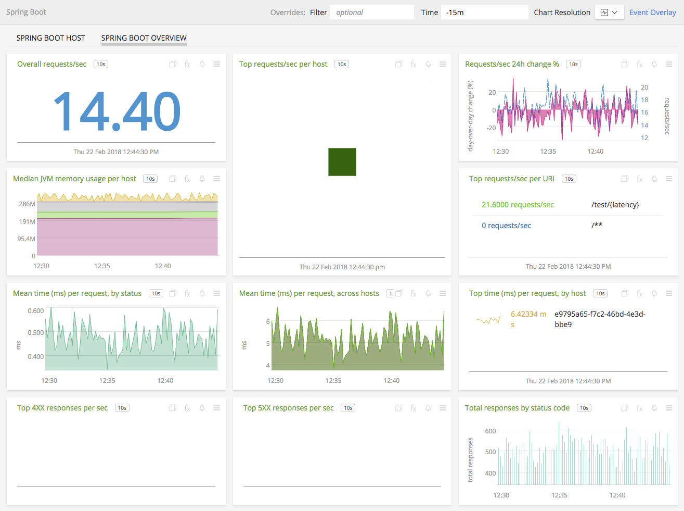
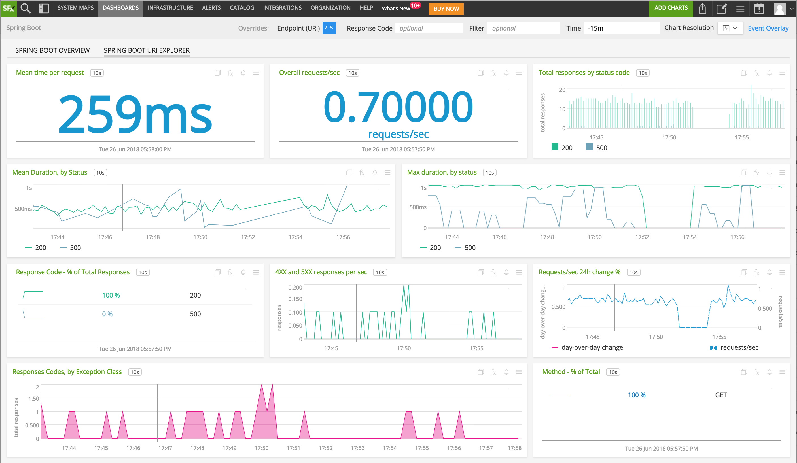
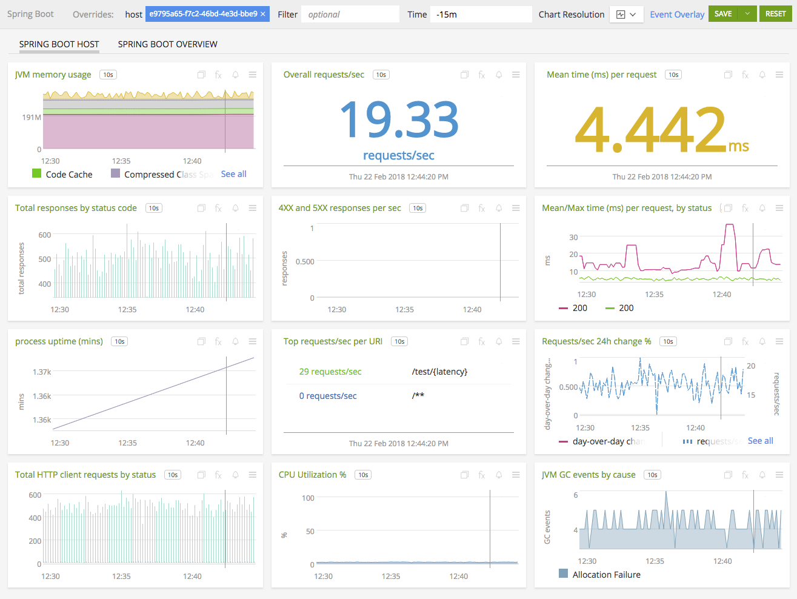

#  Pivotal Spring Boot

- [Description](#description)
- [Installation](#installation)
- [Usage](#usage)
- [License](#license)

### DESCRIPTION

SignalFx integrates with Pivotal Spring Boot via [Micrometer](http://micrometer.io). Use Micrometer to send standard and custom metrics from your JVM-based application code, including Spring Boot applications. 

#### FEATURES

##### Built-in dashboards

- **Spring Boot Overview**: Overview of all Spring Boot applications.

  [](./img/dashboard_springbootoverview.png)
  
- **Spring Boot Host**: Detailed view of one Spring Boot endpoint.

  [](./img/dashboard_springbooturi.png)

### INSTALLATION

See [Micrometer's documentation](http://micrometer.io/docs/registry/signalFx) for installation and configuration steps.

1. Add these properties to your application.properties:

The following properties will ensure that the Spring Boot metrics API endpoint is enabled and a `SignalFxMeterRegistry` is 
created to collect metrics. 

```
# Enable the metrics endpoint
management.endpoint.metrics.enabled=true

# Set the cache duration, make sure this is set <= management.metrics.export.signalfx.step
management.endpoint.metrics.cache.time-to-live=10s

# SignalFx properties (https://docs.spring.io/spring-boot/docs/current/reference/htmlsingle/#production-ready-metrics-export-signalfx)
# To abstract these values into other property sources or environment variables see: http://micrometer.io/docs/registry/signalFx#_configuring
management.metrics.export.signalfx.access-token=YOUR_ACCESS_TOKEN

# The interval at which to emit metrics to SignalFx
management.metrics.export.signalfx.step=10s

# Enable Spring MVC metrics by default
management.metrics.web.server.auto-time-requests=true
```

2. Add the SignalFx library to your project

In Maven, add this dependency to your pom.xml:

```
 		<!-- https://mvnrepository.com/artifact/io.micrometer/micrometer-registry-signalfx -->
		<dependency>
		    <groupId>io.micrometer</groupId>
		    <artifactId>micrometer-registry-signalfx</artifactId>
		    <version>1.0.5</version>
		</dependency>
```
Or in Gradle:
```
compile 'io.micrometer:micrometer-registry-signalfx:latest.release'
```

3. Start your Spring Boot Application for the new properties to take effect

#### Alternative Methods

There following resources are useful for defining the required properties in other ways:
- [SignalFx Registry Properties](https://docs.spring.io/spring-boot/docs/current/reference/htmlsingle/#production-ready-metrics-export-signalfx)
- [Using property sources or environment variables](http://micrometer.io/docs/registry/signalFx#_configuring)

#### TROUBLESHOOTING

When working properly, your application log will contain `INFO` statements confirming that metrics were sent to SFX that look like this:

> 2018-06-08 16:26:36.695  INFO 22966 --- [pool-1-thread-1] i.m.signalfx.SignalFxMeterRegistry       : successfully sent 74 metrics to SignalFx

### USAGE

Sample of built-in dashboards in SignalFx:




### LICENSE

This integration is released under the Apache 2.0 license. See [LICENSE](./LICENSE) for more details.
